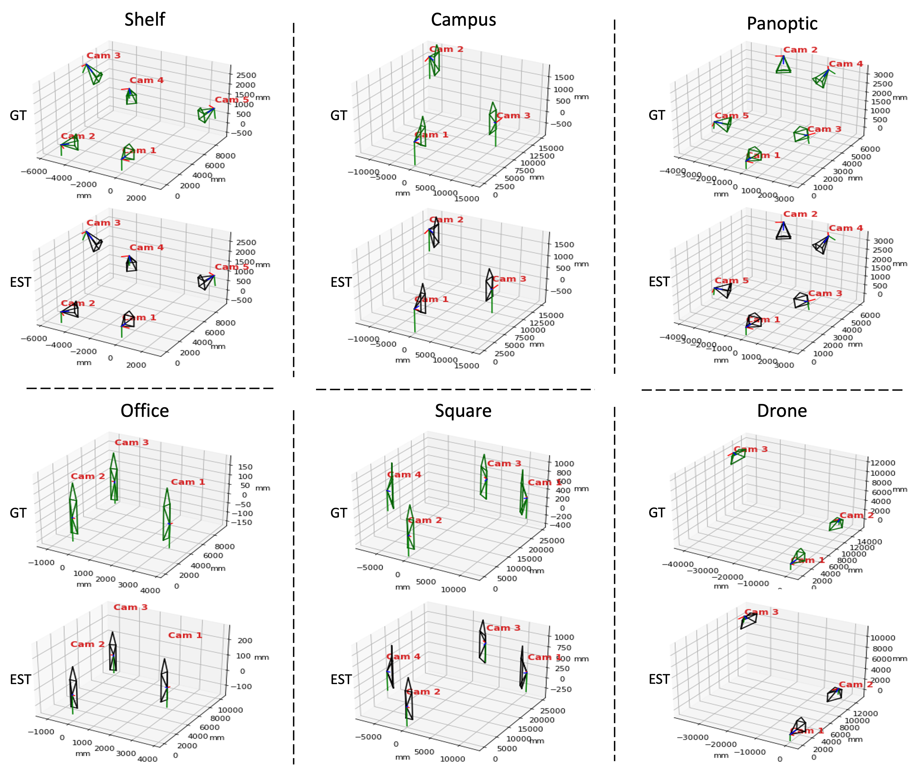
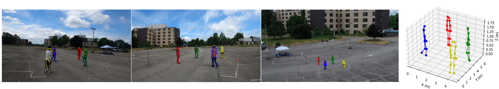

# UncalibratedMVMP

This is the official implementation of **"Multi-View Multi-Person 3D Pose Estimation with Unknown Camera Poses"**.

If you think our work is helpful, please consider citing:

```
@inproceedings{Xu_2022_BMVC,
author    = {Yan Xu and Kris Kitani},
title     = {Multi-View Multi-Person 3D Pose Estimation with Uncalibrated Camera Networks},
booktitle = {33rd British Machine Vision Conference 2022, {BMVC} 2022, London, UK, November 21-24, 2022},
publisher = {{BMVA} Press},
year      = {2022},
url       = {https://bmvc2022.mpi-inf.mpg.de/0132.pdf}
}
```

<p align="left">
    
</p>


## Configure Environment

We used anaconda to configure the Python environment.  To configure the environment, run the following command:
```
  pip install -r requirements.txt
```


## Download Data

We have pre-processed the open Campus and Shelf datasets to the required format.  Please download the datasets at: 

* [Processed Campus Data](https://drive.google.com/file/d/1YCh4GHY3vkwKpSZsnj6sx84cmwFN7XaP/view?usp=sharing)

* [Processed Shelf Data](https://drive.google.com/file/d/1_Y9x0L7PF8ll92CySbpSsKXaXpEurnLx/view?usp=sharing).


## Use Code

We use IPython as the entrance of the code for the consideration of readability.  Simply run the Ipython files would work.  If Ipython is not the preference, copying the contents of the Ipython files into self-defined python files would also work.

## Result

### Multi-view 3D human pose pstimation without knowing the camera poses

<p align="left">
    
</p>

### Camera pose estimation

<p align="left">
    
</p>

### Multi-view 3D human pose pstimation with one moving camera mounted on a flying drone

<p align="left">
    
</p>
