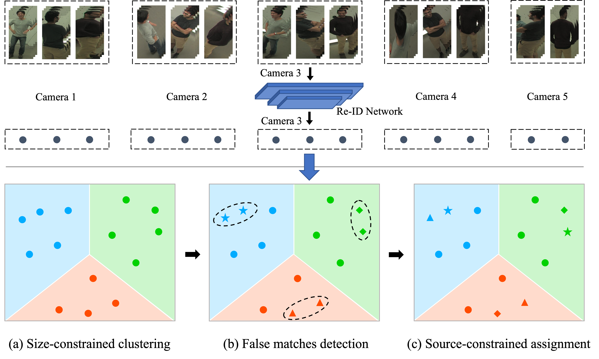
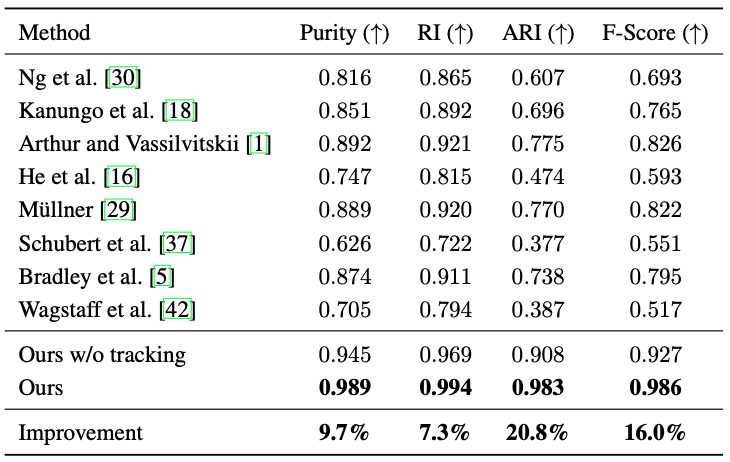
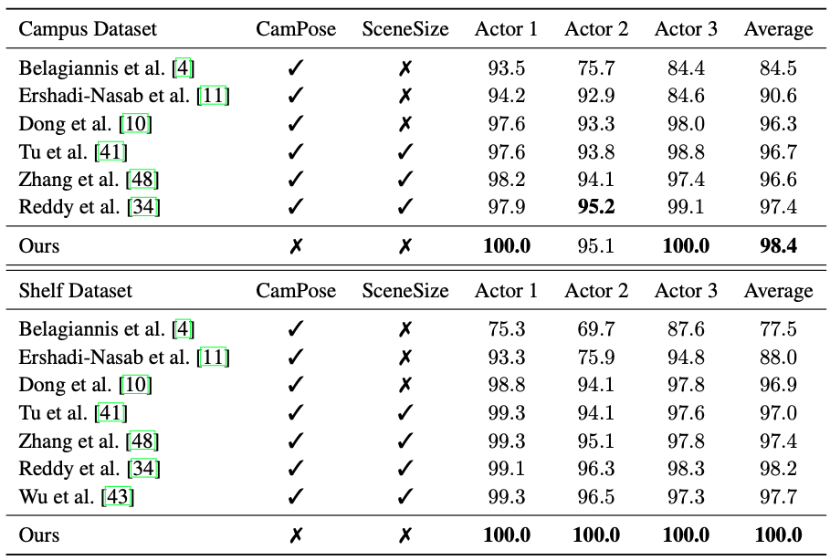

# UncalibratedMVMPWithTracking

This is the official implementation of our paper **"A Multi-Step Clustering Approach For Human Matching Across Multiple Views"**.

If our work is useful to your research, please consider citing:

```
  TO COME...
```

<p align="left">
    
</p>


## Configure Environment

We used anaconda to configure the Python environment.  To configure the environment, run the following command:
```
  pip install -r requirements.txt
```


## Download Data

We have pre-processed the open Campus and Shelf datasets to the required format.  Please download the datasets at: 

* [Processed Campus Data](https://drive.google.com/file/d/1YCh4GHY3vkwKpSZsnj6sx84cmwFN7XaP/view?usp=sharing)

* [Processed Shelf Data](https://drive.google.com/file/d/1_Y9x0L7PF8ll92CySbpSsKXaXpEurnLx/view?usp=sharing).


## Use Code

We use IPython as the entrance of the code for the consideration of readability.  Simply run the Ipython files would work.  If Ipython is not the preference, copying the contents of the Ipython files into self-defined python files would also work.

## Result Showcase

### Cross-View Human Matching on CMU Panoptic dataset

<p align="left">
    
</p>

<p align="left">
    
</p>

### Multi-View Multi-Person 3D Human Pose Estimation

<p align="left">
    
</p>
